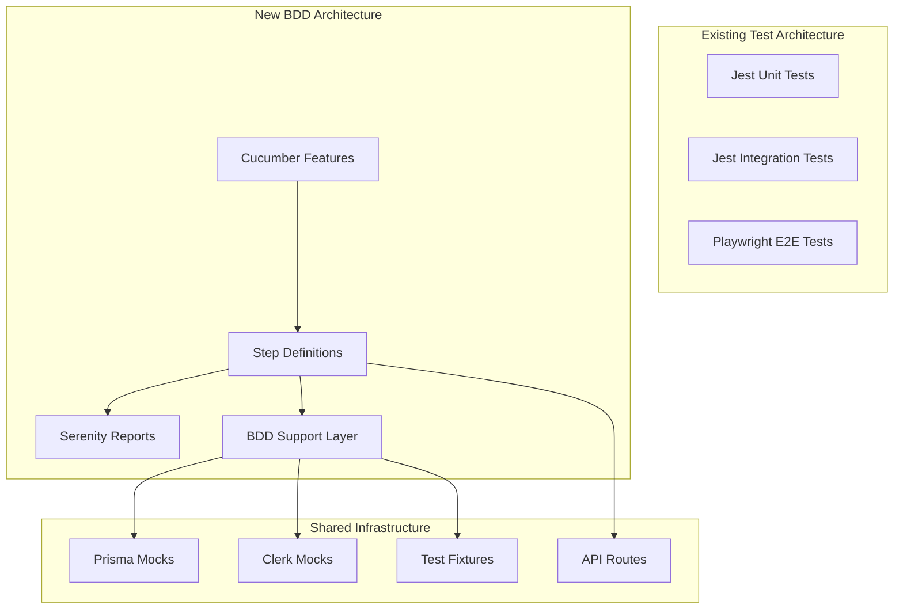

# Design Document - Pruebas BDD con Cucumber + Serenity

## Overview

Este documento describe el diseño técnico para implementar pruebas BDD (Behavior Driven Development) usando Cucumber + Serenity BDD en el proyecto TrackMyMoney. El diseño se enfoca en complementar la arquitectura de pruebas existente sin interferir con Jest, Playwright o las pruebas unitarias/integración ya implementadas.

## Architecture

### High-Level Architecture



### Technology Stack

- **Cucumber.js**: Para definir y ejecutar escenarios BDD
- **Serenity-JS**: Para reportes avanzados y patrón Screenplay
- **TypeScript**: Manteniendo tipado fuerte
- **Jest Environment**: Reutilizando configuración existente
- **Existing Mocks**: Clerk y Prisma mocks centralizados

## Components and Interfaces

### 1. Feature Files Structure

```
tests/bdd/features/
├── gastos.feature              # Gestión de gastos
├── ingresos.feature            # Gestión de ingresos  
├── categorias.feature          # Gestión de categorías
└── flujos-integrados.feature   # Flujos end-to-end
```

### 2. Step Definitions Architecture

```typescript
// Interface para Step Definitions
interface StepDefinitionContext {
  world: BDDWorld;
  apiClient: APIClient;
  mockManager: MockManager;
  dataBuilder: TestDataBuilder;
}

// World object para compartir estado entre steps
interface BDDWorld {
  currentUser: MockUser;
  lastResponse: APIResponse;
  testData: TestDataStore;
  errors: ValidationError[];
}
```

### 3. API Client Layer

```typescript
interface APIClient {
  gastos: {
    create(data: GastoInput): Promise<APIResponse>;
    list(): Promise<APIResponse>;
    getById(id: number): Promise<APIResponse>;
  };
  ingresos: {
    create(data: IngresoInput): Promise<APIResponse>;
    list(): Promise<APIResponse>;
  };
  categorias: {
    create(data: CategoriaInput): Promise<APIResponse>;
    list(): Promise<APIResponse>;
  };
}
```

### 4. Mock Management Layer

```typescript
interface MockManager {
  setupAuthenticatedUser(userData?: Partial<MockUser>): void;
  setupUnauthenticatedUser(): void;
  resetAllMocks(): void;
  configurePrismaMocks(config: PrismaMockConfig): void;
}
```

## Data Models

### Test Data Models

```typescript
interface MockUser {
  id: string;
  email: string;
  firstName: string;
  clerk_id: string;
  dbUser?: {
    id: number;
    nombre: string;
    email: string;
    moneda_preferida: string;
  };
}

interface GastoInput {
  monto: number;
  fecha: string;
  descripcion?: string;
  categoria_id?: number;
  factura?: boolean;
  metodo_pago?: string;
}

interface IngresoInput {
  monto: number;
  fecha: string;
  descripcion?: string;
  categoria_id?: number;
  tipo_ingreso: string;
  recurrente?: boolean;
  frecuencia?: string;
  fecha_fin?: string;
}

interface CategoriaInput {
  nombre: string;
  usuario_id: number;
}
```

### Response Models

```typescript
interface APIResponse {
  status: number;
  data: any;
  error?: string;
  details?: string;
}

interface ValidationError {
  field: string;
  message: string;
  code: string;
}
```

## Error Handling

### Error Categories

1. **Validation Errors**: Campos requeridos, formatos inválidos
2. **Authentication Errors**: Usuario no autenticado
3. **Business Logic Errors**: Reglas de negocio violadas
4. **System Errors**: Errores de base de datos o sistema

### Error Handling Strategy

```typescript
class BDDErrorHandler {
  handleValidationError(error: ValidationError): void;
  handleAuthError(error: AuthError): void;
  handleBusinessError(error: BusinessError): void;
  handleSystemError(error: SystemError): void;
}
```

## Testing Strategy

### Test Categories

#### 1. Happy Path Tests
- Creación exitosa de gastos, ingresos, categorías
- Consultas exitosas de datos
- Flujos completos sin errores

#### 2. Validation Tests
- Campos obligatorios faltantes
- Formatos de datos inválidos
- Reglas de negocio violadas

#### 3. Edge Cases
- Montos límite (negativos, muy grandes)
- Fechas límite (futuras, muy pasadas)
- Nombres de categorías límite

#### 4. Integration Tests
- Flujos completos entre módulos
- Consistencia de datos
- Relaciones entre entidades

### Test Data Strategy

```typescript
class TestDataBuilder {
  buildValidGasto(overrides?: Partial<GastoInput>): GastoInput;
  buildValidIngreso(overrides?: Partial<IngresoInput>): IngresoInput;
  buildValidCategoria(overrides?: Partial<CategoriaInput>): CategoriaInput;
  buildInvalidData(type: 'gasto' | 'ingreso' | 'categoria', errorType: string): any;
}
```

## Configuration

### Cucumber Configuration

```typescript
// cucumber.config.ts
export default {
  require: ['tests/bdd/step-definitions/**/*.ts'],
  format: [
    'progress-bar',
    'json:tests/bdd/reports/cucumber-report.json',
    '@serenity-js/cucumber'
  ],
  formatOptions: {
    specDirectory: 'tests/bdd/features'
  },
  paths: ['tests/bdd/features/**/*.feature'],
  requireModule: ['ts-node/register'],
  worldParameters: {
    apiBaseUrl: 'http://localhost:3000/api',
    timeout: 10000
  }
};
```

### Serenity Configuration

```typescript
// serenity.config.ts
export default {
  crew: [
    '@serenity-js/console-reporter',
    '@serenity-js/serenity-bdd',
    ['@serenity-js/core:ArtifactArchiver', { outputDirectory: 'tests/bdd/reports' }]
  ],
  outputDirectory: 'tests/bdd/reports'
};
```

## Integration Points

### 1. Package.json Scripts

```json
{
  "scripts": {
    "test:bdd": "cucumber-js --config=cucumber.config.ts",
    "test:bdd:watch": "cucumber-js --config=cucumber.config.ts --watch",
    "test:bdd:report": "serenity-bdd update && serenity-bdd run",
    "test:all": "npm run test:jest && npm run test:bdd"
  }
}
```

### 2. CI/CD Integration

```yaml
# GitHub Actions example
- name: Run BDD Tests
  run: |
    npm run test:bdd
    npm run test:bdd:report
    
- name: Upload BDD Reports
  uses: actions/upload-artifact@v3
  with:
    name: bdd-reports
    path: tests/bdd/reports/
```

### 3. Mock Integration

```typescript
// Reutilizar mocks existentes
import { mockPrismaClient } from '../__mocks__/prisma';
import { mockAuthenticatedUser } from '../__mocks__/clerk';

class MockManager {
  setupMocks() {
    // Reutilizar configuración existente
    mockAuthenticatedUser();
    // Configurar Prisma mocks específicos para BDD
    this.configurePrismaMocks();
  }
}
```

## Performance Considerations

### 1. Test Execution Speed
- Reutilizar mocks existentes para evitar overhead
- Paralelización de escenarios independientes
- Cache de configuración entre tests

### 2. Memory Management
- Cleanup automático después de cada escenario
- Reset de mocks entre features
- Gestión eficiente de test data

### 3. Reporting Optimization
- Generación de reportes en paralelo
- Compresión de artifacts grandes
- Cleanup automático de reportes antiguos

## Security Considerations

### 1. Test Data Security
- No usar datos reales de producción
- Sanitización de datos de prueba
- Exclusión de información sensible en reportes

### 2. Mock Security
- Validación de que mocks no filtren a producción
- Aislamiento completo de servicios externos
- Verificación de que Clerk mocks no exponen tokens reales

## Monitoring and Observability

### 1. Test Metrics
- Tiempo de ejecución por feature
- Tasa de éxito/fallo por escenario
- Cobertura de casos de prueba

### 2. Reporting
- Reportes HTML detallados con Serenity
- Screenshots en caso de fallos
- Logs estructurados para debugging

### 3. Alerting
- Notificaciones en caso de fallos críticos
- Métricas de tendencia de calidad
- Integración con herramientas de monitoreo existentes